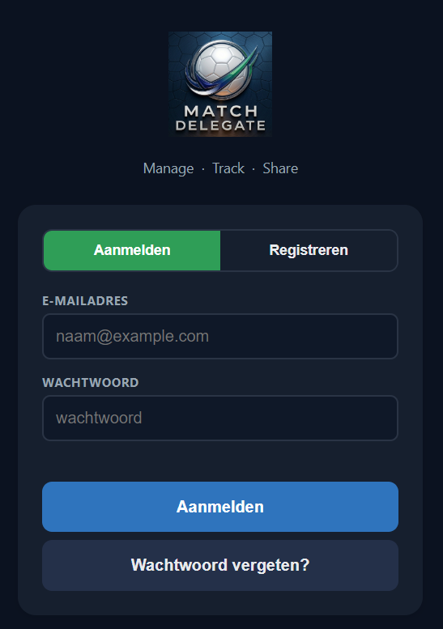
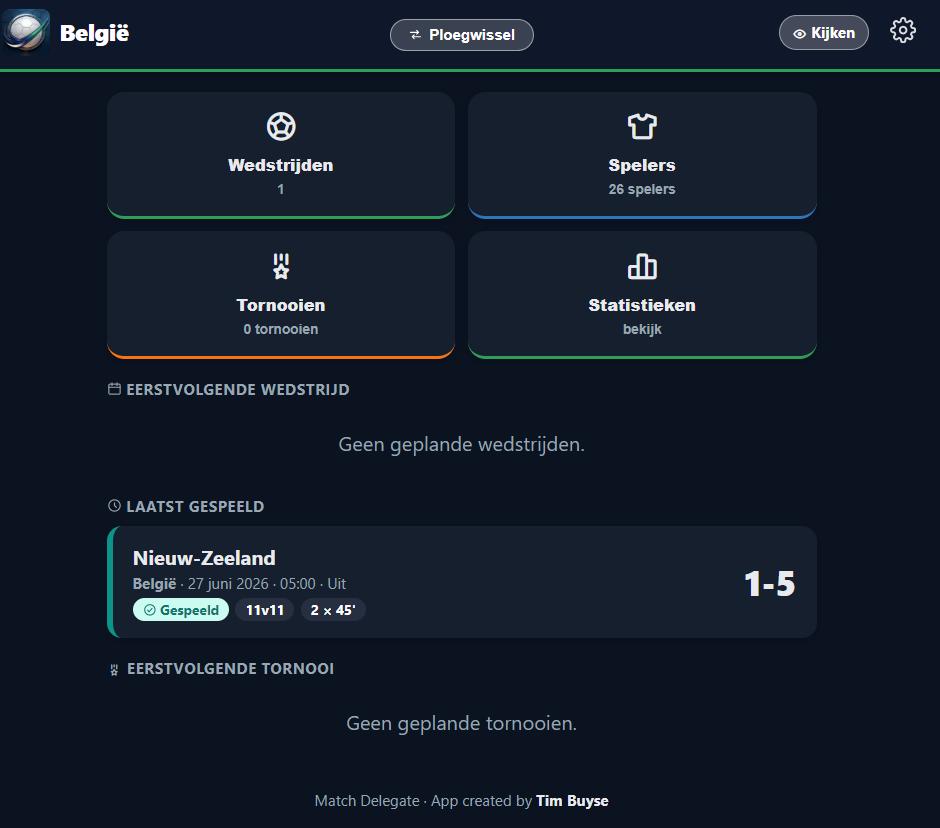
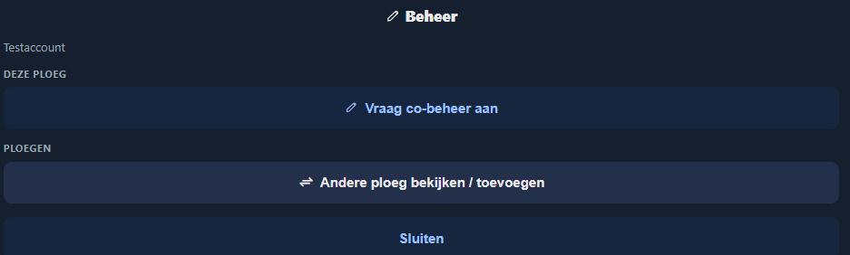
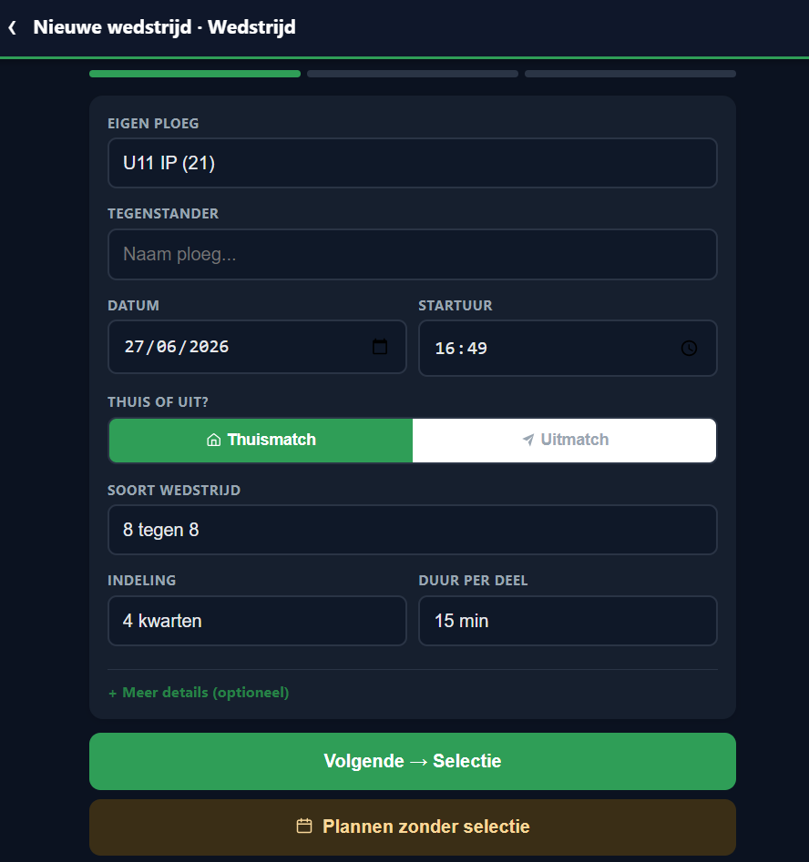
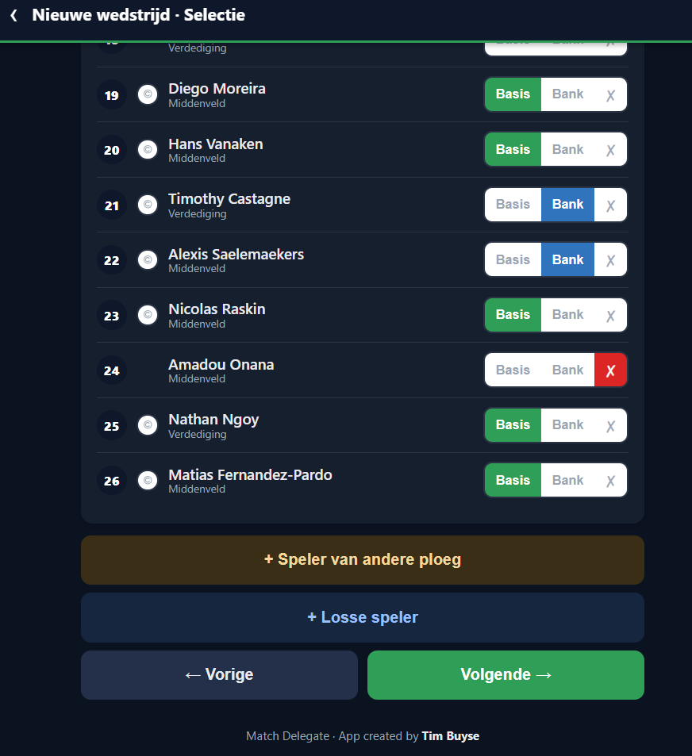
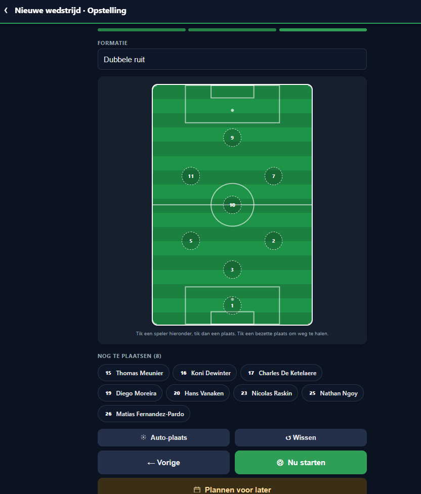
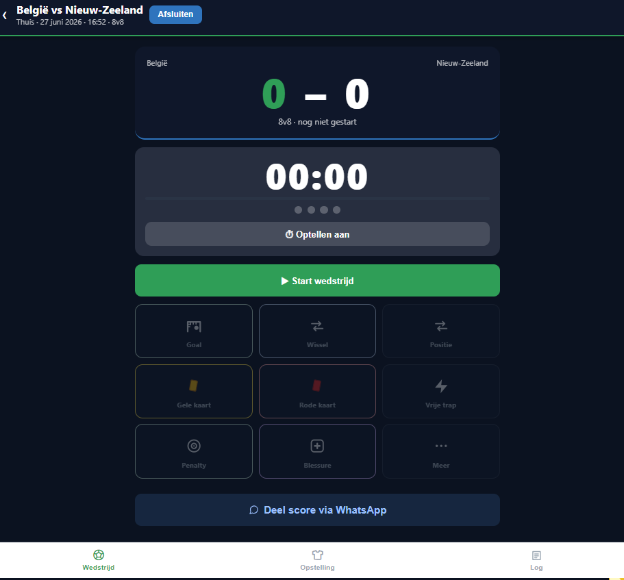
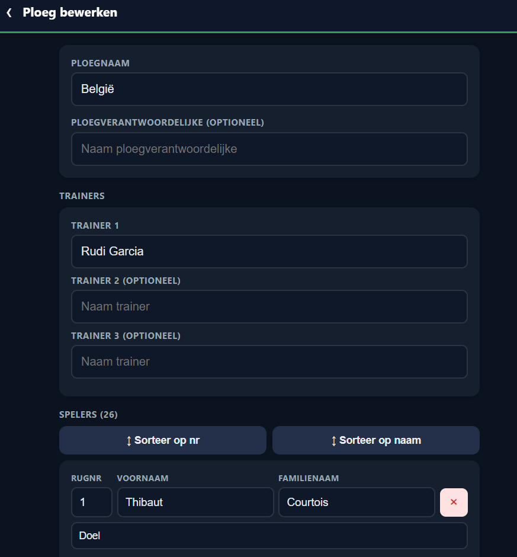
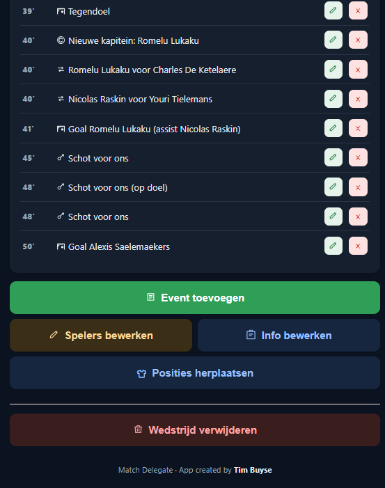
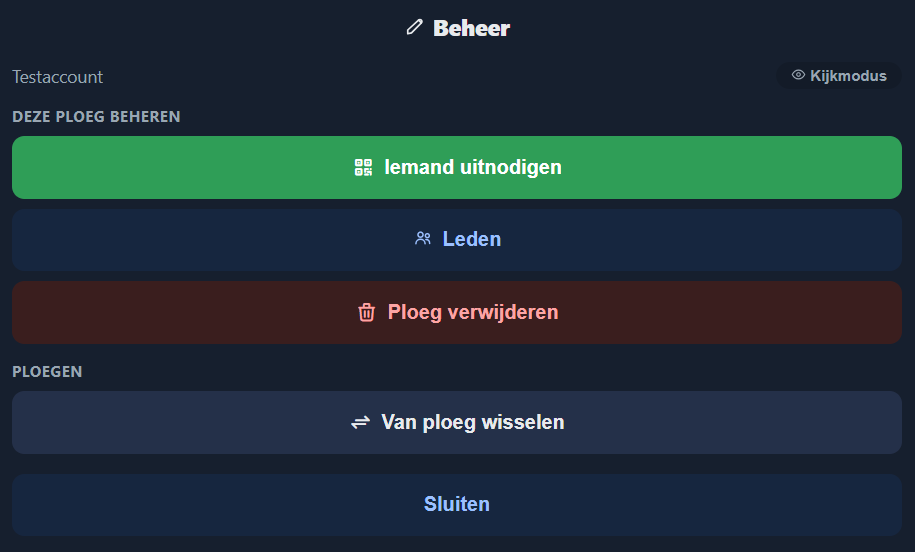

# Match Delegate — Gebruikershandleiding
*Manage · Track · Share*

---

## 1. De app installeren

Match Delegate is een webapplicatie die je rechtstreeks in je browser kan gebruiken, maar ook op je smartphone kan installeren als een gewone app.

### In de browser

Surf naar **[https://timbuyse.github.io/MatchDelegate/](https://timbuyse.github.io/MatchDelegate/)**. Je hebt geen account nodig om de installatiestap te zetten, maar je hebt wel een internetverbinding nodig.

### Installeren op iPhone / iPad (iOS)

1. Open de app in **Safari**.
2. Tik onderaan op het **deelknopje** (het vierkantje met een pijl omhoog).
3. Scroll omlaag en kies **'Zet op beginscherm'**.
4. Geef de app een naam (of laat 'Match Delegate' staan) en tik op **'Voeg toe'**.
5. De app verschijnt nu als icoon op je beginscherm, net als een gewone app.

### Installeren op Android

1. Open de app in **Chrome**.
2. Tik rechtsboven op de **drie puntjes** (⋮).
3. Kies **'Toevoegen aan startscherm'**.
4. Bevestig door op **'Toevoegen'** te tikken.
5. De app verschijnt nu op je startscherm.

> **Tip:** Door de app te installeren op je beginscherm laad je ze sneller en heb je een betere ervaring dan via de browser.

---

## 2. Account aanmaken & aanmelden

### Account aanmaken

1. Open Match Delegate en tik op het tabblad **'Registreren'**.
2. Vul je **e-mailadres** en een **wachtwoord** in.
3. Tik op **'Registreren'**.
4. Je bent meteen aangemeld en kan de app gebruiken.

### Aanmelden

1. Open Match Delegate — het **'Aanmelden'**-tabblad is standaard actief.
2. Vul je **e-mailadres** en **wachtwoord** in.
3. Tik op **'Aanmelden'**.

> **Wachtwoord vergeten?** Tik op **'Wachtwoord vergeten?'** en volg de instructies die je per e-mail ontvangt.

---

## 3. Rollen in de app

Match Delegate werkt met drie rollen. Elke rol geeft andere mogelijkheden.

| Rol | Wat kan je doen? |
|---|---|
| **Kijker** | Een ploeg volgen en live wedstrijden bekijken |
| **Co-beheerder** | Wedstrijden aanmaken en live bijhouden, spelers beheren |
| **Beheerder** | Alles van co-beheerder + ploeg aanmaken, leden uitnodigen en goedkeuren |

Wanneer je een account aanmaakt, start je als **kijker**. Je kan daarna:
- Een ploeg volgen via een uitnodigingslink.
- **Co-beheer aanvragen** bij de beheerder van een ploeg.
- Een beheerdersrol aanvragen en daarna via **'Nieuwe ploeg aanmaken'** een eigen ploeg starten (zie hoofdstuk 6).

---

## 4. Als kijker

Als kijker zie je het homescherm van de ploeg met de tegels **Wedstrijden**, **Spelers**, **Tornooien** en **Statistieken**. Rechtsboven staat de knop **'Kijken'**. Je kan geen wedstrijden aanmaken of bewerken.

### Een ploeg volgen via uitnodiging

De beheerder van een ploeg kan een uitnodiging delen op drie manieren: als **link**, als **QR-code** of als **6-cijferige code**. Zo vervoeg je een ploeg:

**Via link**
1. Tik op de uitnodigingslink die je ontvangen hebt (via WhatsApp, e-mail, ...).
2. De app opent en vraagt om bevestiging.
3. Tik op **'Ploeg vervoegen'**.

**Via QR-code**
1. Scan de QR-code met je smartphone.
2. De app opent en vraagt om bevestiging.
3. Tik op **'Ploeg vervoegen'**.

**Via code**
1. Open Match Delegate en tik op **'Ploeg bekijken via code'**.
2. Voer de 6-cijferige code in die je van de beheerder ontvangen hebt.
3. Tik op **'Bevestigen'**.

Na elk van deze stappen ben je kijker van de ploeg en kan je alle wedstrijden volgen.

### Een live wedstrijd bekijken

1. Open de app en ga naar **'Wedstrijden'**.
2. Tik op een lopende wedstrijd (aangeduid met een live-indicator).
3. Je ziet de score, het verloop en alle events (doelpunten, kaarten, wissels) in real time.

> Als kijker kan je niets wijzigen — je kan alleen meekijken.

---

## 5. Als co-beheerder

### Co-beheer aanvragen

Ben je al kijker van een ploeg en wil je meer doen? Dan kan je co-beheer aanvragen:

1. Tik rechtsboven op **'Beheer'**.
2. Tik op **'Vraag co-beheer aan'**.
3. De beheerder krijgt een melding en kan je aanvraag goedkeuren of weigeren.
4. Zodra je aanvraag goedgekeurd is, krijg je toegang als co-beheerder.

> Je kan maar co-beheerder worden van een ploeg waarvan je al kijker bent. Vraag eerst een uitnodiging aan de beheerder.

### Wedstrijd aanmaken

1. Tik op de grote blauwe knop **'+ Nieuwe wedstrijd'** op het homescherm.
2. De wizard bestaat uit **3 stappen**. Vul in stap 1 (**Wedstrijd**) de basisgegevens in:
   - **Tegenstander**: naam van de tegenstander.
   - **Datum** en **Startuur**.
   - **Thuis of uit**: kies **'Thuismatch'** of **'Uitmatch'**.
   - **Format**: kies het format (bv. 8 tegen 8, 11 tegen 11).
   - **Aantal blokken**: aantal wedstrijddelen (bv. 4 kwarten, 2 helften).
   - **Duur van een blok**: de speelduur per wedstrijddeel in minuten.
   - Optioneel: tik op **'+ Meer details'** voor extra informatie.
3. Tik op **'Volgende → Selectie'** om door te gaan naar stap 2.

**Stap 2 — Selectie**

4. Verdeel de spelers over drie groepen door per speler te kiezen:
   - **Basis** — start in de basisopstelling.
   - **Wissel** — wisselspeler.
   - **X** — niet geselecteerd.
5. Staat een speler niet in de lijst? Voeg hem toe via:
   - **'+ Losse speler'** — een tijdelijke speler die niet in je vaste squad staat.
   - **'+ Speler van andere ploeg'** — een speler uit een andere ploeg die je beheert.
6. Tik op **'Volgende →'** om door te gaan naar stap 3.

**Stap 3 — Opstelling**

7. Kies bovenaan een **formatie** uit de lijst (bv. Dubbele ruit). Je kan de formatie op elk moment in deze stap nog wijzigen.
8. Plaats de basisspelers op het veld: tik eerst een speler aan in de lijst onderaan, tik dan op een positie op het veld. Tik op een bezette positie om de speler er weer af te halen.
9. Gebruik **'Auto-plaats'** om spelers automatisch in te vullen, of **'Wissen'** om opnieuw te beginnen.
10. Tik op **'Nu starten'** om de wedstrijd meteen te starten, of op **'Plannen voor later'** om ze op te slaan zonder te starten.

> Wil je de wedstrijd alvast plannen zonder opstelling? Tik dan in stap 1 op **'Plannen zonder selectie'**.

### Een wedstrijd live bijhouden

1. Open de wedstrijd en tik op **'► Start wedstrijd'** om de timer te starten.
2. Gebruik de knoppen om events te registreren:
   - **Goal** — doelpunt voor of tegen, door welke speler.
   - **Wissel** — speler eraf en speler erin. Wissels kunnen ook tijdens de pauze doorgevoerd worden.
   - **Positie** — positiewisseling zonder spelerswisseling.
   - **Gele kaart / Rode kaart** — welke speler.
   - **Penalty** — penalty registreren.
   - **Blessure** — geblesseerde speler noteren.
   - **Meer** — extra opties, o.a. **Vrije trap**.
3. De puntjes onder de timer tonen de wedstrijddelen. De timer loopt per deel.
4. Tik op **'Deel score via WhatsApp'** om de huidige stand te delen.
5. Onderaan navigeer je tussen **Wedstrijd**, **Opstelling** en **Log**.
6. Events zijn meteen zichtbaar voor alle kijkers.
7. Tik op **'Afsluiten'** om de wedstrijd te beëindigen.

> **Fout geregistreerd?** Je kan events verwijderen via het tabblad **'Log'**.

### Ploeg & spelers beheren

Via de tegel **'Spelers'** op het homescherm kom je in het scherm **'Ploeg bewerken'**. Hier beheer je alle ploeginfo:

- **Ploegnaam** — de naam van je ploeg.
- **Ploegverantwoordelijke** (optioneel) — naam van de verantwoordelijke.
- **Trainers** — tot 3 trainers invullen (trainer 1 is verplicht, 2 en 3 optioneel).
- **Spelers** — de volledige spelerslijst met rugnummer, voornaam, familienaam en positie. Sorteer op nummer of naam. Verwijder een speler via het rode kruisje.

#### Losse spelers

Wil je een speler opstellen die niet in je vaste squad staat?

1. Tik tijdens de spelerselectie op **'+ Losse speler'**.
2. Vul de naam in.
3. De losse speler is beschikbaar voor die wedstrijd, maar wordt niet opgeslagen in je squad.

### Wedstrijd bekijken na afloop

Open een gespeelde wedstrijd om de volledige samenvatting te zien: eindscore, wedstrijdinfo (formatie, trainer, scheidsrechter, locatie, kapitein, man v/d match) en alle geregistreerde events met tijdstip.

Per event kan je het potloodicoon gebruiken om te **bewerken**, of het rode kruisje om te **verwijderen**.

Onderaan vind je ook:
- **'Event toevoegen'** — voeg achteraf nog een event toe.
- **'Spelers bewerken'** — pas de spelerslijst aan.
- **'Info bewerken'** — pas de wedstrijdgegevens aan.
- **'Posities herplaatsen'** — pas de opstelling op het veld aan.
- **'Wedstrijd verwijderen'** — verwijder de wedstrijd definitief.

### PDF genereren & delen

1. Open de afgelopen wedstrijd.
2. Tik op **'PDF'** om een wedstrijdverslag te genereren. Je kan het opslaan of delen.
3. Tik op **'Delen'** om de wedstrijd te delen via je toestel.
4. Tik op **'Export'** om de wedstrijddata te exporteren.
5. Tik op **'Deel via WhatsApp'** om de score snel te delen.

Het PDF-verslag bevat: de ploegen, de score, de opstelling, de wedstrijdinfo en alle geregistreerde events.

---

## 6. Als beheerder

### Beheerdersrol aanvragen

Om ploegen te kunnen aanmaken, heb je eerst de beheerdersrol nodig. Die vraag je als volgt aan:

1. Tik op **'+ Nieuwe ploeg aanmaken'** (zie ook screenshot in hoofdstuk 4).
2. Omdat je nog geen beheerder bent, wordt je gevraagd om de beheerdersrol aan te vragen. Bevestig dit.
3. De eigenaar van Match Delegate beoordeelt je aanvraag en keurt ze goed of af.
4. Je krijgt een melding zodra je aanvraag verwerkt is.

> Dit goedkeuringsproces bestaat om misbruik van de app te vermijden en duurt normaal gezien niet lang.

### Een nieuwe ploeg aanmaken

Heb je de beheerdersrol? Dan kan je meteen ploegen aanmaken:

1. Ga naar **'Instellingen'** en tik op **'Nieuwe ploeg aanmaken'**.
2. Vul de naam van je ploeg in en bevestig.
3. De ploeg is meteen beschikbaar en je bent automatisch beheerder.

### Kijkers uitnodigen

1. Tik rechtsboven op de groene knop **'Beheer'**.
2. Tik op **'Iemand uitnodigen'**.
3. Deel de uitnodiging via link, QR-code of 6-cijferige code (zie hoofdstuk 4).
4. Iedereen die de uitnodiging gebruikt en een account heeft, wordt automatisch kijker van jouw ploeg.

### Leden beheren & co-beheer goedkeuren

1. Tik rechtsboven op **'Beheer'** → **'Leden'**.
2. Hier zie je een overzicht van alle kijkers en co-beheerders van je ploeg.
3. Openstaande co-beheeraanvragen verschijnen ook in dit scherm. Tik op **'Goedkeuren'** of **'Weigeren'** — de aanvrager krijgt meteen een melding.

### Kijkmodus

Als beheerder kan je ook meekijken als gewone kijker, zonder toegang tot de beheerfuncties:

1. Tik rechtsboven op **'Beheer'**.
2. Tik op **'Kijkmodus'** (rechtsboven in het beheerpaneel).
3. Je ziet de ploeg nu vanuit het perspectief van een kijker.

### Alle functies van co-beheerder

Als beheerder kan je alles wat een co-beheerder ook kan: wedstrijden aanmaken, live bijhouden, spelers beheren en PDF's genereren. Zie **hoofdstuk 5** voor de details.

---

## 7. Tornooi

Match Delegate beschikt over een tornooifunctie. De documentatie hierover is nog in opmaak en wordt binnenkort toegevoegd aan deze handleiding.

---

*Vragen of problemen? Neem contact op met de beheerder van jouw ploeg.*
